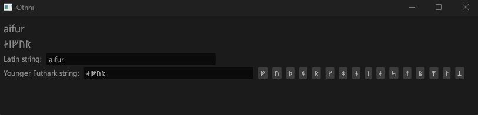

# Othni
Runic transliterator

While [Rundata](https://rundata.info/) provides a great resource for searching known runic texts, this requires the stone in question to already be transliterated into latin characters for searching their database. This application aims to bridge the transliteration gap.

Fonts:

http://legionfonts.com/fonts/segoe-ui-historic#information
https://learn.microsoft.com/en-us/typography/font-list/segoe-ui-historic